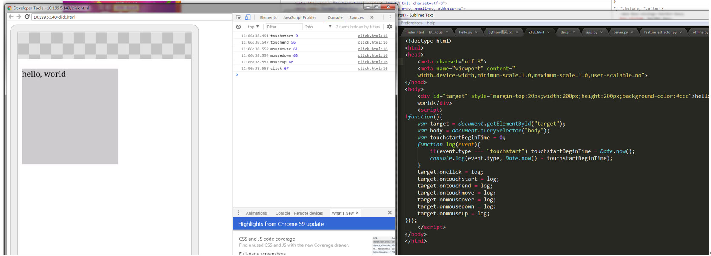
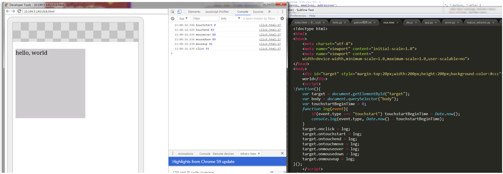
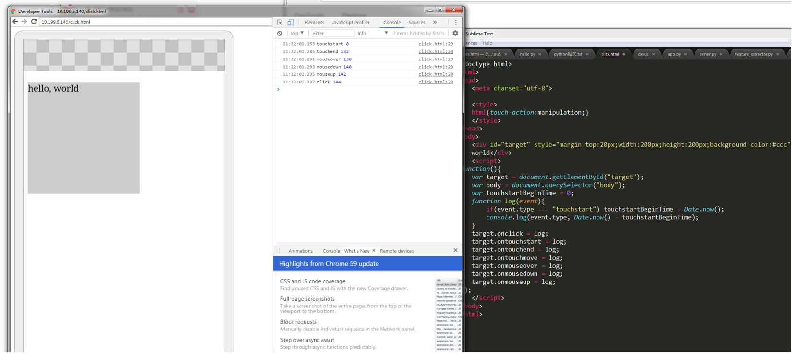
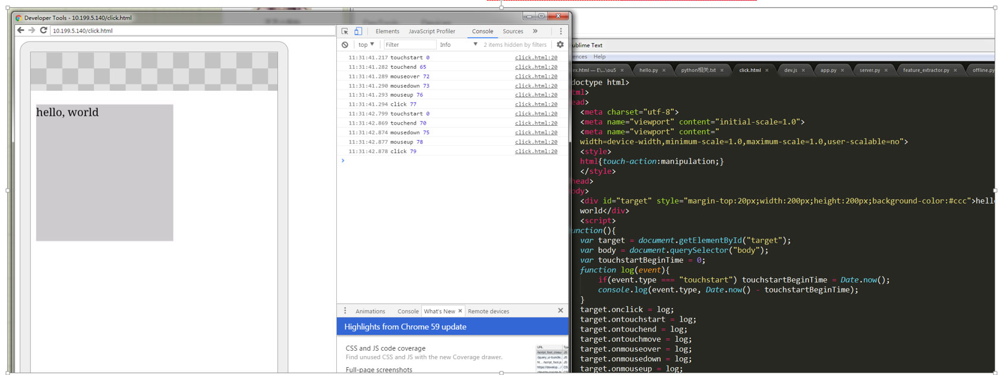
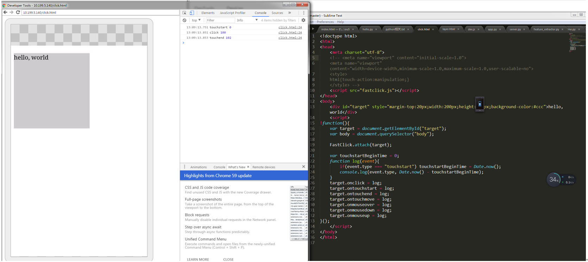
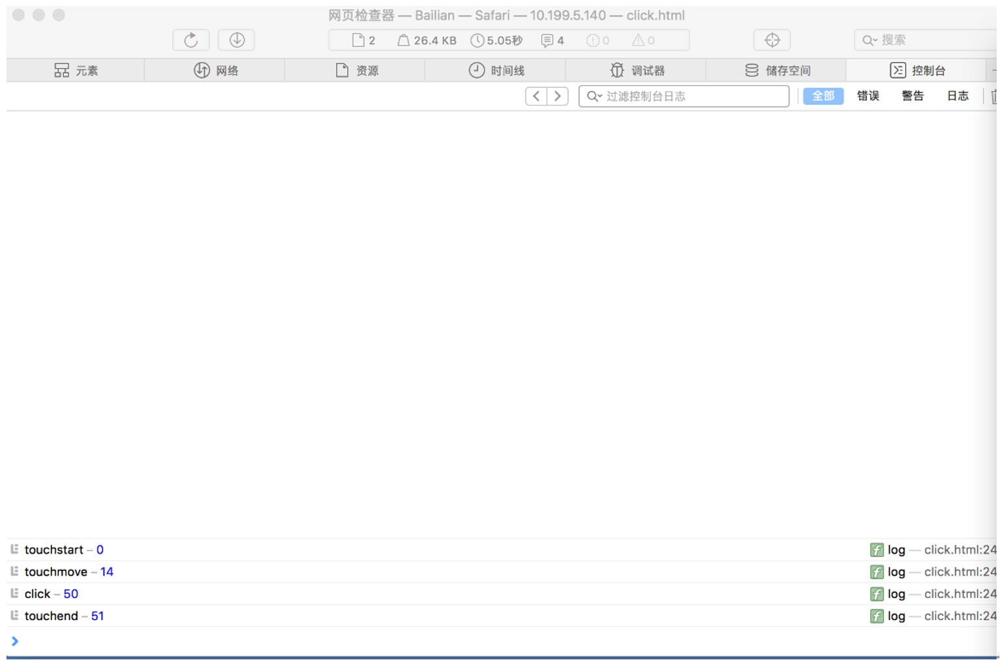

# 浏览器Click延时300MS测试
##移动端的延迟为什么存在
在移动浏览器中，当你点击按钮的单击事件时，将会等待大约300ms的时间。这是因为，浏览器是等着看，如果你是真正执行双击。
##Fastclick.js兼容性
> Mobile Safari on iOS 3 and upwards 
> 
> Chrome on ios 5 and upwards 
> 
> Chrome on Android (ICS) 
> 
> Opera Mobile 11.5 and upwards 
> 
> android Browser since Android 2 
> 
> PlayBook OS 1 and upwards

##分别在安卓和IOS上进行了测试
## 一、安卓环境，chrome58，手机华为p10连电脑

1、 无width=device-width，initial-scale=1.0，touch-action:manipulation

2、有initial-scale=1.0

3、有width=device-width

4、有width=device-width，initial-scale=1.0

5、加touch-action:manipulation

6、有width=device-width，initial-scale=1.0，touch-action:manipulation

7、使用fastclick.Js

##二、IOS环境，safari，手机iphone连电脑
1、ios8.1，手机iphone5s，只有fastclick

2、ios8.1，手机iphone5s，无fastclick；有width=device-width，initial-scale=1.0

3、ios10.2.1，手机iphone6s plus，只有fastclick

4、ios10.2.1，手机iphone6s plus，无fastclick；有width=device-width，initial-scale=1.0

> 验证ios9.3以上支持width=device-width，无300MS延时。

> Android 系统版本4.4以上user-scalable=no也是有用的

> 注：Android 系统版本5.0上基于chromium 37；Android 系统版本4.4.3上基于chromium 33；iphone6s出厂ios9

**结论：只适合在移动浏览器，chrome32, ios9.3以上可以不使用fastclick。国产安卓手机许多UI系统的浏览器是基于webkit开发的，如需要消除300ms延时，还是需要fastclick；苹果在Iphone7以上机型才能可以不使用fastclick**
