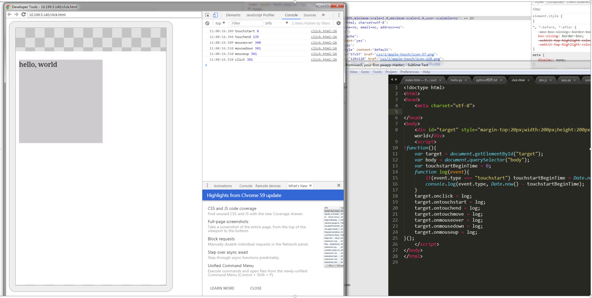
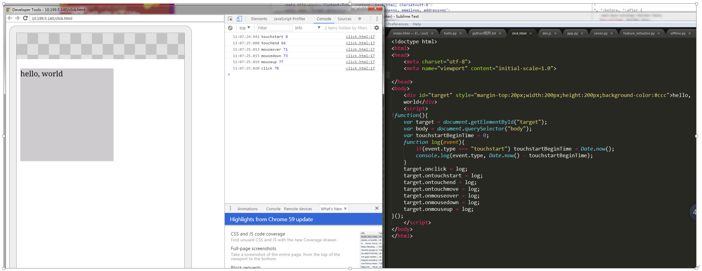

# 浏览器Click延时300MS测试
分别在安卓和IOS上进行了测试
## 一、安卓环境，chrome58，手机华为p10连电脑

1、 无width=device-width，initial-scale=1.0，touch-action:manipulation

2、有initial-scale=1.0

3、有width=device-width

4、有width=device-width，initial-scale=1.0

5、加touch-action:manipulation

6、有width=device-width，initial-scale=1.0，touch-action:manipulation

7、使用fastclick.Js

##二、IOS环境，safari，手机iphone连电脑
1、ios8.1，手机iphone5s，只有fastclick

2、ios8.1，手机iphone5s，无fastclick；有width=device-width，initial-scale=1.0

3、ios10.2.1，手机iphone6s plus，只有fastclick

4、ios10.2.1，手机iphone6s plus，无fastclick；有width=device-width，initial-scale=1.0

**验证ios9.3以上支持width=device-width，无300MS延时。
结论：chrome32, ios9.3以上可以不使用fastclick。
Android 系统版本4.4以上user-scalable=no也是有用的
注：Android 系统版本5.0上基于chromium 37；Android 系统版本4.4.3上基于chromium 33；iphone6s出厂ios9**
