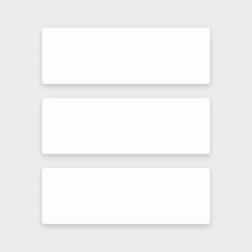
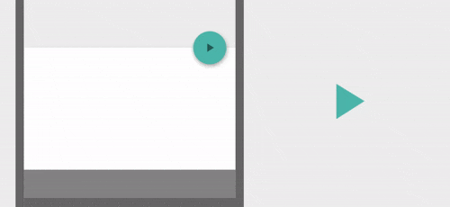
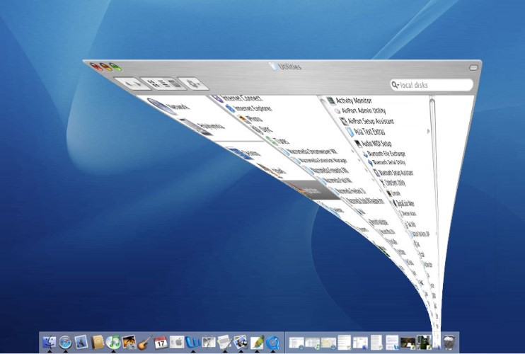
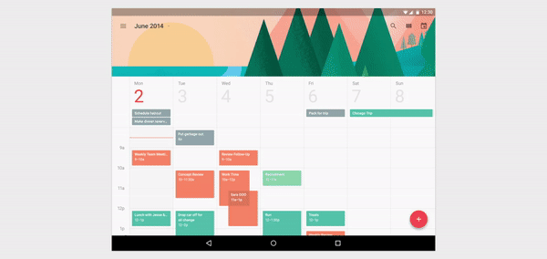
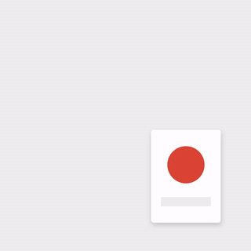
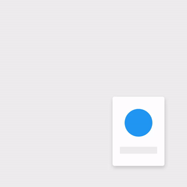
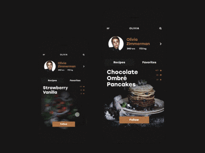
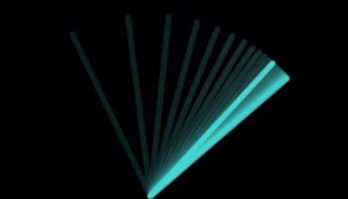
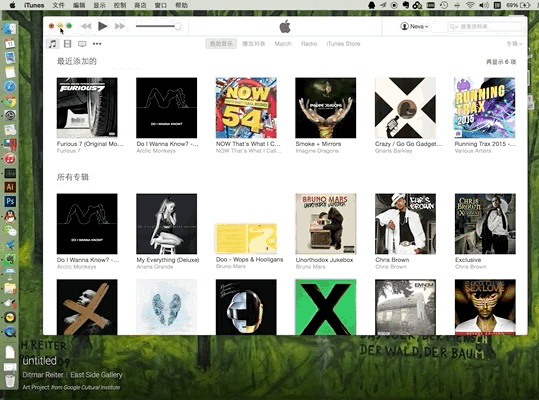

# 动效开发的时候需要理解和常用方法 #

动效有以下几个优点：

- -由于动画让用户更容易理解界面之间的关系，所以减轻了很多认知负担。
- -通过消除屏幕上的跳变，让界面不让用户吃惊并费解，从而让体验更加愉快。
- -将物理世界的运动用在动画中，缩短了用户和界面之间的鸿沟，让用户更专注于任务而不是理解界面。

更为重要的是，真正优秀的动效能让界面变得栩栩如生。

通过让元素在形态上进行叠加、分割、延伸、形变，动效让界面给人以更为真实、更加“物理”的质感。流畅顺滑的动效帮用户联通起上下文，阐释界面元素之间的关系，强化UI的层次感，消解环节与环节之间的冲突，缓解加载和过渡中的等待。

## 响应 ##
动效制作，是让使用者清楚的知道什么样的操作会带来什么样的反馈。

比如：现实中按电灯开关，可以使灯明亮和关闭。

在动效制作中，使界面的响应和操作形成对应关系。UI应当精准而快速的针对用户的交互作出响应，只有这样用户才能将他们的操作、交互和控件的变化、效果联系到一起，形成回路。当他们清楚的知道什么样的操作会带来什么样的反馈，他们会觉得非常爽的。

## 关联 ##
动效要提供了必要的视觉线索，让人理解某个动作前后发生了什么，是单个元素，页面之间的关联起来。

当用户感知不到之间的关系时，就说明因果关系不够清晰。让用户理解动效之间的关系至关重要，这直接关系到操作效率。

平滑的过渡不仅让两者的功能呈现了出来，而且强化了两者的逻辑关系。

## 自然 ##
好的动效设计应当尽量避免突兀的转变。应该师法自然，比如，现实世界中物体的加速和减速都会受到重量、惯性和摩擦力的影响，类似的，在动效设计中，瞬间的启动和停止是不合规律的。

## 意图 ##
用户第一次同某个界面进行交互的时候，他们本身是无法准确预知交互的结果的，但是动效的引导能够让用户明白变化的趋势，并且不会觉得变化是突然的。

比如：MacOSX 的用户点击最小化按钮之后，界面会收缩卷曲收纳到底部的Dock中，这个动效的变化过程连接了显示和隐藏两个状态，而这个特效则让用户了解两者的因果关系。

## 快速 ##
当界面或者控件借助动效转变位置和状态的时候，动效的速度应当适中，它不能太慢，得让用户不会为了动效加载而等待，同样也不能太快，得让用户明白和理解这个转变的过程与关系。

尽量在300ms内搞定动效，在用户能注意到细节的前提下完成过渡过程。

## 清晰 ##
当一个动效中容纳太多过程的时候，难免会让人看不清、感到迷惑，不同的元素沿着不同的轨迹向着不同方向运动，人的眼睛很难Get到全部的过程，自然而然会感到混乱。

就是保持动效清晰明了的核心规则，炫技式的动效还是少做的好。

## 动效开发几个方法 ##
### 拟物化 ###
在动效中，人物和元素都是真实的，有重量的物体。他们每次走动都好像是生活在真实世界中一样，这种感觉非常真实。这种拟物感不仅仅是填充一个像素区域那么简单，这些物件的运动是通过增加惯性来实现的。

开发的动效，例如：慢进慢出，跟随，和弧形运动，都是基于这个原则，他们是有质量的物体。

    拟物化的方法一：运动模糊。经验法则：如果一个物体移动超过物体本身一半的大小（或者更大）的任何两帧之间，加入运动模糊效果。
    
    拟物化的方法二：出现和消失。除了移动，元素无规则的出现和消失也会造成用户困惑。在UI设计中，有三种方式展示出现消失的效果：移入，擦除，和模糊消失。他们的动作是快而连续的，给用户必要的视觉线索来理解发生了什么。

### 夸张 ###
通过“夸张现实”的手法，往往可以让设计达到事倍功半的效果。经过夸张手法处理的动效表现的更现实。

UI界面必须让用户理解，并在必要时突出一些细节。采用夸张的方式，使UI界面中的某些对象可以更容易理解，更加“现实”，从而使UI界面更吸引人。

    夸张方法：给用户足够的预期
    在动作发生之前，最好给给观众一些提示。当动作发生时，观众已经准备好，而不必对所发生的动作所惊讶。
    比如:当鼠标移动到某一功能时，icon会跳动一下，提醒用户点击之后会有变化

### 增强现实 ###
所有的动效技术都会增强某个现实。有些会非常极端－就像在某些动画中，角色高速移动，变成了一道光线，快速的穿过屏幕。实际上这是非常隐蔽的手法。观众不会感知到这些效果很夸张。他们只是感觉超现实。这些夸张的效果已经被精心处理，所以观众不会被这些夸张效果所困惑。

    增强现实方法一：缓进缓出。缓进缓出效果出现在某一个快速动作之前，有助于观看时更加舒适。比如：https://medium.com/@pasql/transitional-interfaces-926eb80d64e3
    
    增强现实方法二：弧形运动。圆弧路径的运动给人一种更吸引人，更活泼的感觉，而直线运动则比较简单。比如：Mac OS X中，最小化窗口使用了弧线，显得更加活泼
    
    增强现实方法三：跟随运动。在现实世界中，当主物体发成运动时，与其关联的物体会做出跟随运动。比如：iOS中，移动app位置是典型的跟随运动效果，当App插入一个新位置时，其他app位置跟着位移。

## 效果实例 ##

